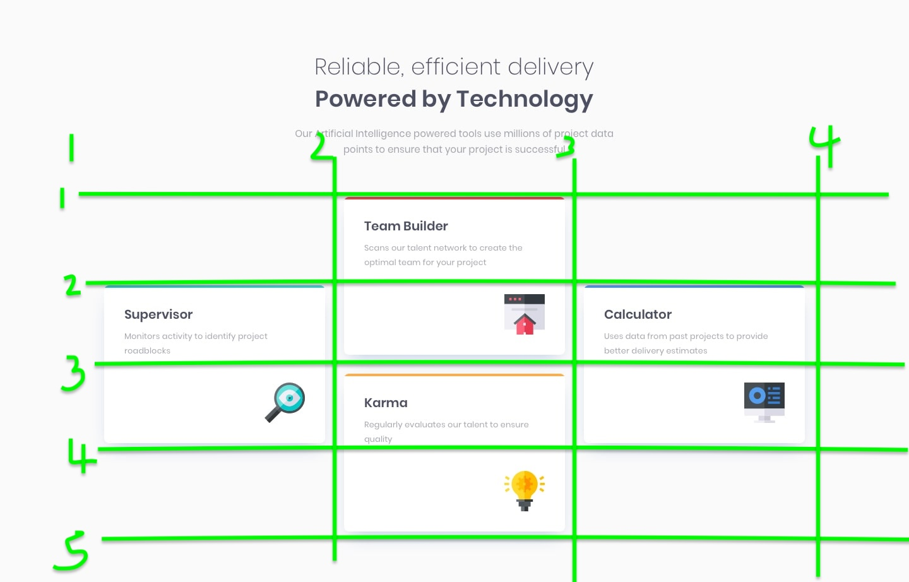

Four Card Feature Section Challenge

This project is a front-end coding challenge that involves creating a four card feature section. The challenge is to build a responsive layout where each card represents a different feature or service. This README provides an overview of the challenge requirements, how to set up the project, and additional resources for further learning.

Challenge Overview
The challenge is to create a feature section with four cards, each showcasing a unique feature or service. The layout should be responsive and visually appealing, providing clear information about each feature.

Requirements
Display four cards, each containing:
Title
Description
Icon or image representing the feature
Ensure the layout is responsive and looks good on various screen sizes.
Use CSS to style the cards, ensuring readability and visual consistency.
Implement hover effects or interactive elements to enhance user experience if desired.
Technologies Used
HTML: Markup language for structuring the content of the feature section.
CSS: Styling language used to design and layout the cards.
React (optional): JavaScript library used to create reusable UI components and manage state.
Setup Instructions
Clone the repository to your local machine using the following command:

bash
Copy code
git clone https://github.com/VictorKevz/four-card-feature-section
Navigate to the project directory:

bash
Copy code
cd four-card-feature-section
If you're using Vite React, install dependencies and start the development server:

arduino
Copy code
npm install
npm run dev
If you're using plain HTML and CSS, simply open the index.html file in your web browser.

View the project in your web browser by navigating to http://localhost:3000 or the appropriate port specified by your development server.

Project Structure
The project directory structure may vary depending on whether you're using Vite React or plain HTML/CSS:

For Vite React:

src/: Directory containing React components and other source files.
public/: Directory containing static assets like images or icons.
index.html: Main HTML file where the React app is mounted.
App.jsx: Main React component responsible for rendering the feature section.
styles.css: CSS file containing styles for the feature section.
components/: Directory containing React components used in the project.
For plain HTML/CSS:

index.html: Main HTML file containing the structure of the feature section.
styles.css: CSS file containing styles for the feature section.
images/: Directory containing images or icons used in the feature cards.
Additional Resources
MDN Web Docs: Comprehensive web development documentation and guides.
CSS Tricks: Tips, tricks, and tutorials on CSS and front-end development.
React Documentation: Official documentation for React library.
Vite Documentation: Official documentation for Vite build tool.